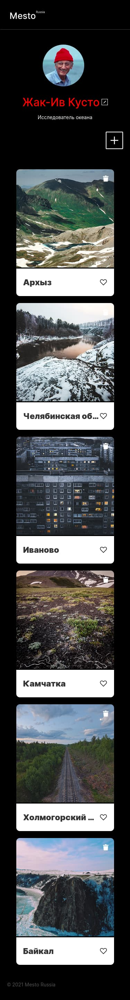
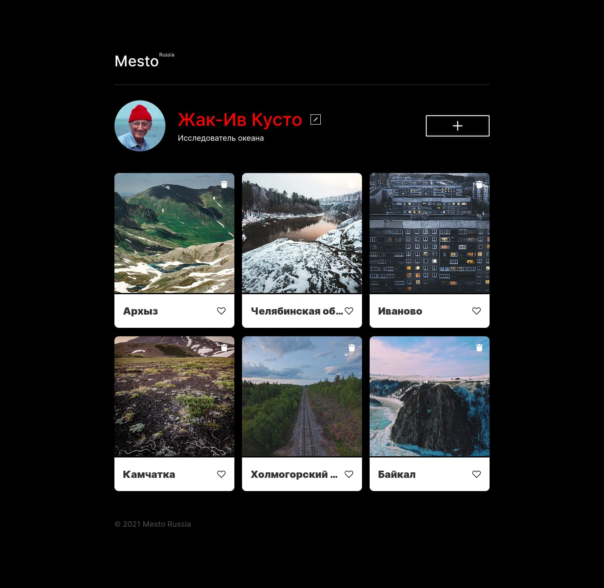

https://github.com/MikeBeloborodov/mesto-project-ff
# Яндекс Практикум, проектная работа "Mesto"

## Оглавление

- [Запуск](#запуск)
- [Скриншоты](#скриншоты)
- [Описание](#описание)
- [Автор](#автор)
- [Благодарность](#благодарность)

### Запуск

```
git pull https://github.com/MikeBeloborodov/mesto-project-ff.git
cd mesto-project-ff
npm i
npm run dev
```

### Скриншоты




### Описание

Интерактивная страница, куда можно добавлять фотографии, удалять их и ставить лайки.

Использованные технологии: Webpack.

## Автор

- Github - [Mike Beloborodov](https://github.com/MikeBeloborodov)
- Frontend Mentor - [@MikeBeloborodov](https://www.frontendmentor.io/profile/MikeBeloborodov)

## Благодарность

Благодарю команду Яндекс Практикум за предоставление дизайна и уроков!
